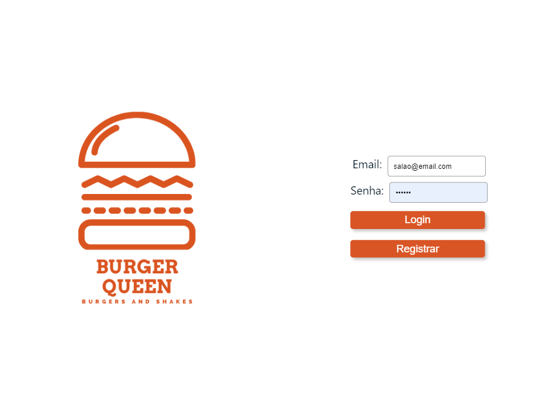
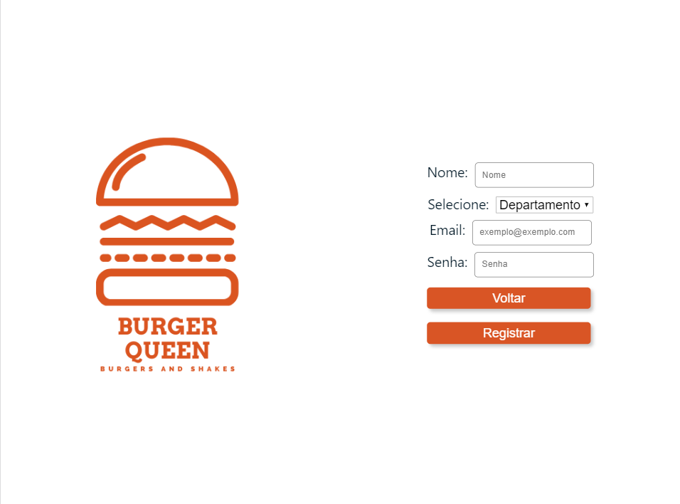
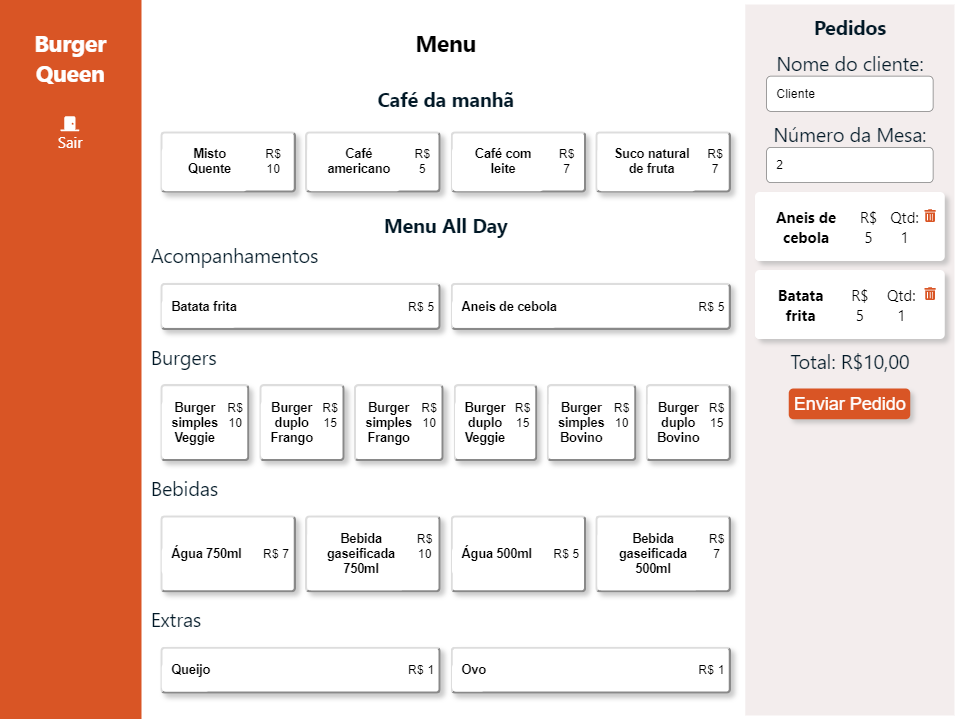
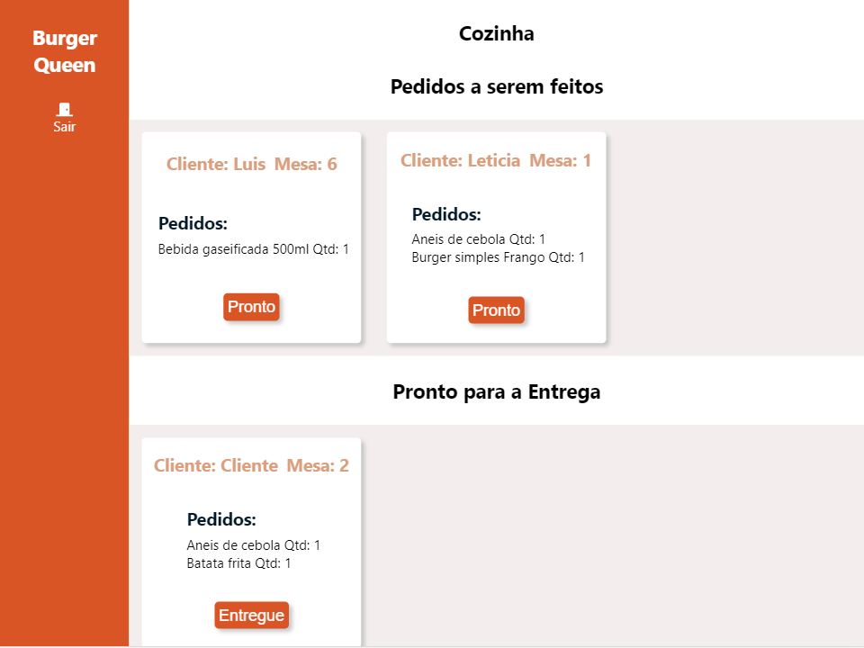

## Índice

* [1. Burguer Queen](#1-Burguer-Queen)
* [2. Resumo do Projeto](#2-Resumo-do-Projeto)
* [4. Tecnologias](#4-processo-de-design-e-Tecnologias)
* [5. Considerações Gerais](#5-considerações-gerais)
* [6. Interface](#6-interface)

## 1. Burger Queen

Aplicação desenvolvida para restaurante com intuito de realizar pedidos no Salão através de um tablet, e enviá-los para a cozinha para que sejam preparados de forma ordenada e eficiente.

## 2. Resumo do Projeto

A interface do Salão deve mostrar um menu com café da manhã e restante do dia,com todos os seus respectivos produtos. O usuário deve poder escolher que produtos adicionar e a interface deve mostrar o resumo do pedido com o custo total.

A Cozinha deverá receber o pedido a ser preparado e poder marcá-lo como pronto para que o atendente entregue o produto, podendo assim, marcar que o produto foi entregue, também deverá ter um histórico dos pedidos finalizados.

## 4. Tecnologias

## Tecnologias
* HTML5
* JavasScript (ES6)
* React Hooks
* @fortawesome/react-fontawesome
* growl-alert

## 5. Considerações Gerais
* Interface deve ser pensada específicamente para rodar em tablets.
* Aplicativo Web responsivo.
* O aplicativo é um Single Page App.

## 6. Interface

